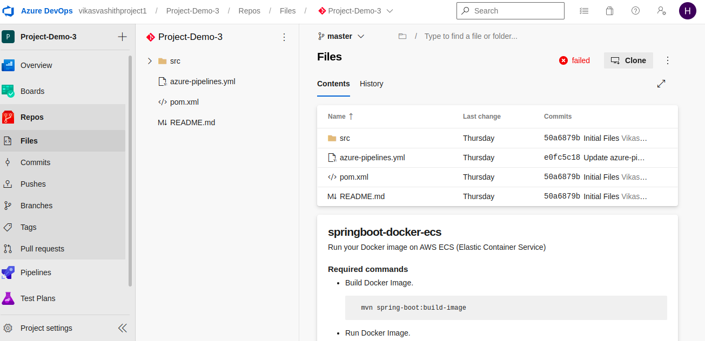
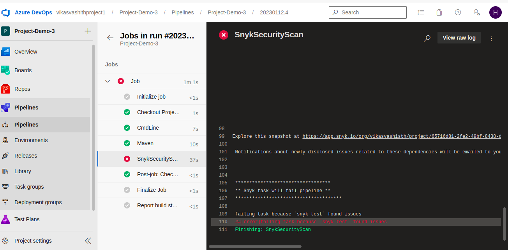
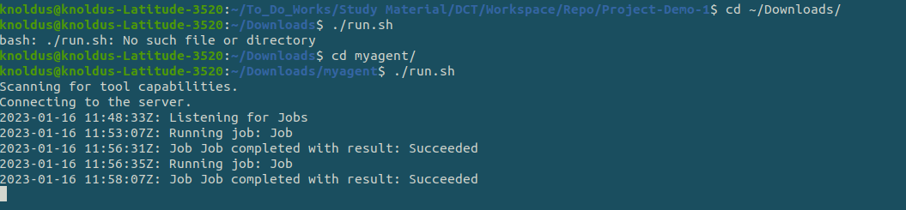
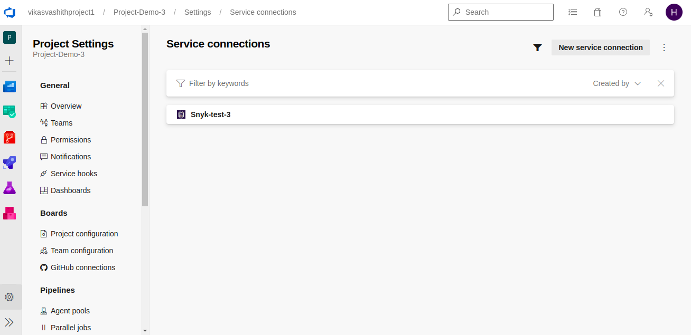
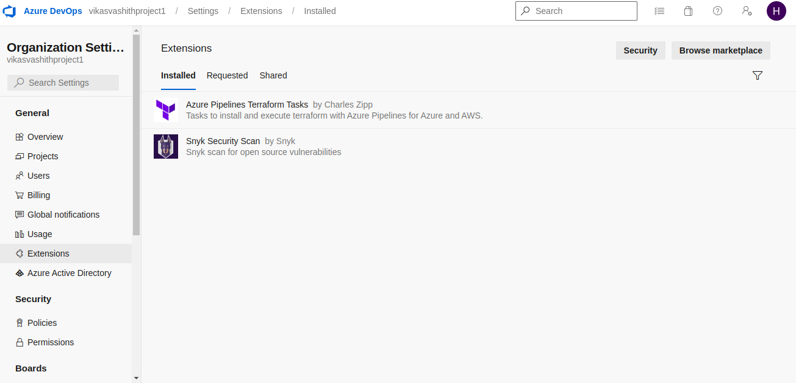

## Description
Here, In this template you will get to know about how to integrate Snyk in your Azure CI with your maven based project.

---

#### Pre-requisite

* Azure Cloud/DevOps account
* Github Setup in Azure DevOps.
* Agent Setup to run the CI pipeline.
* Add Service Connection for Snyk Account. [find the steps below]

---

### Steps:-
1. Login into the AZ account using the `az login`.
2. Push the code on Github.

3. Run the pipeline to trigger the build for the maven based project and check the code vulnerability. If there is any code vulnerability it will fail the build (just like in the picture). 

Snyk integration using the yaml file :- 
[azure-pipelines.yaml](maven-project/azure-pipelines.yaml)

4. You can check the code vulnerability report by login into your Snyk account also.
---

### Notes 
 I have set-up agent in my local to run the pipeline. 

 
 

`Project Setting-> Service connections -> New service connection`

If you don't find Service (Snyk) , Go to `Organization Setting -> Extensions -> Browser marketplace`

---
